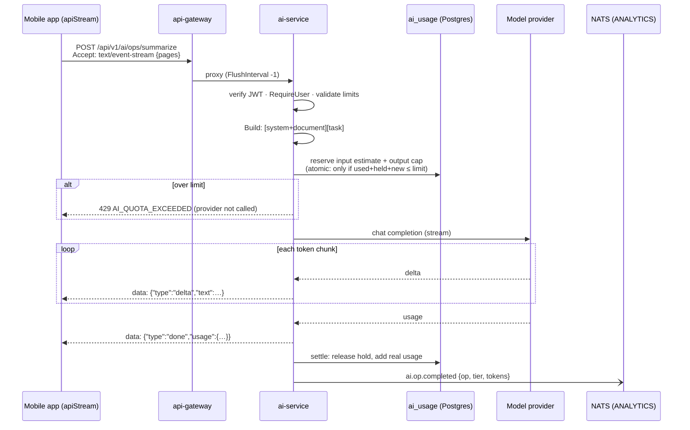
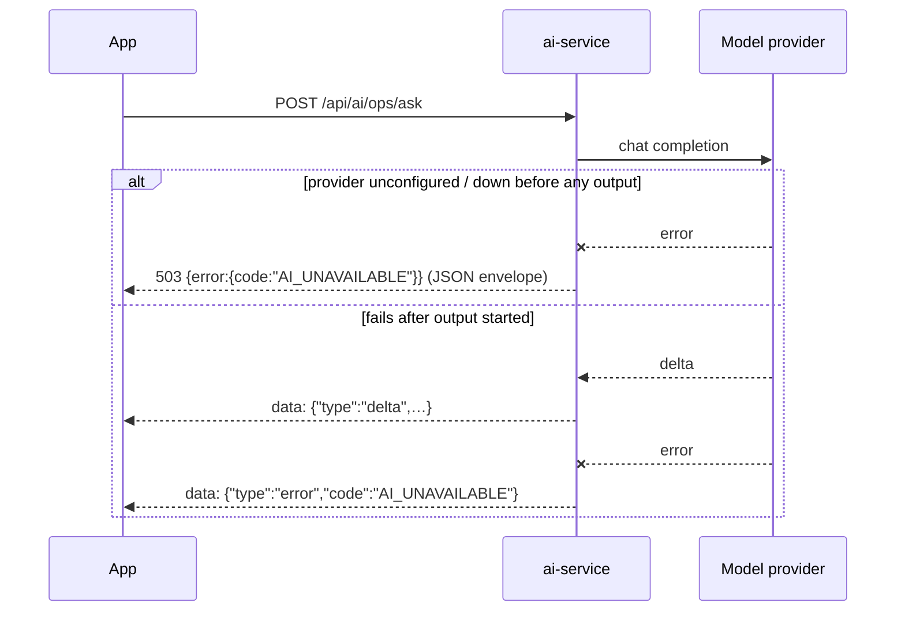
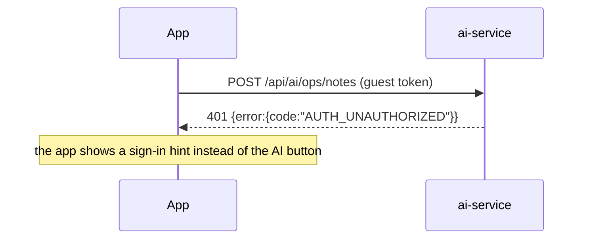

# AI Service -- Sequence Diagrams

Request flows through `ai-service` (port 8092).

## Streamed op (happy path)

```mermaid
sequenceDiagram
    participant App as Mobile app (apiStream)
    participant GW as api-gateway
    participant AI as ai-service
    participant Q as ai_usage (Postgres)
    participant P as Model provider
    participant N as NATS (ANALYTICS)

    App->>GW: POST /api/v1/ai/ops/summarize<br/>Accept: text/event-stream {pages}
    GW->>AI: proxy (FlushInterval -1)
    AI->>AI: verify JWT · RequireUser · validate limits
    AI->>AI: Build: [system+document][task]
    AI->>Q: reserve input estimate + output cap<br/>(atomic: only if used+held+new ≤ limit)
    alt over limit
        AI-->>App: 429 AI_QUOTA_EXCEEDED (provider not called)
    end
    AI->>P: chat completion (stream)
    loop each token chunk
        P-->>AI: delta
        AI-->>App: data: {"type":"delta","text":…}
    end
    P-->>AI: usage
    AI-->>App: data: {"type":"done","usage":{…}}
    AI->>Q: settle: release hold, add real usage
    AI-)N: ai.op.completed {op, tier, tokens}
```

## Failure before the first delta vs. mid-stream

```mermaid
sequenceDiagram
    participant App
    participant AI as ai-service
    participant P as Model provider

    App->>AI: POST /api/ai/ops/ask
    AI->>P: chat completion
    alt provider unconfigured / down before any output
        P--xAI: error
        AI-->>App: 503 {error:{code:"AI_UNAVAILABLE"}} (JSON envelope)
    else fails after output started
        P-->>AI: delta
        AI-->>App: data: {"type":"delta",…}
        P--xAI: error
        AI-->>App: data: {"type":"error","code":"AI_UNAVAILABLE"}
    end
```

## Guest

```mermaid
sequenceDiagram
    participant App
    participant AI as ai-service
    App->>AI: POST /api/ai/ops/notes (guest token)
    AI-->>App: 401 {error:{code:"AUTH_UNAUTHORIZED"}}
    Note over App: the app shows a sign-in hint instead of the AI button
```
